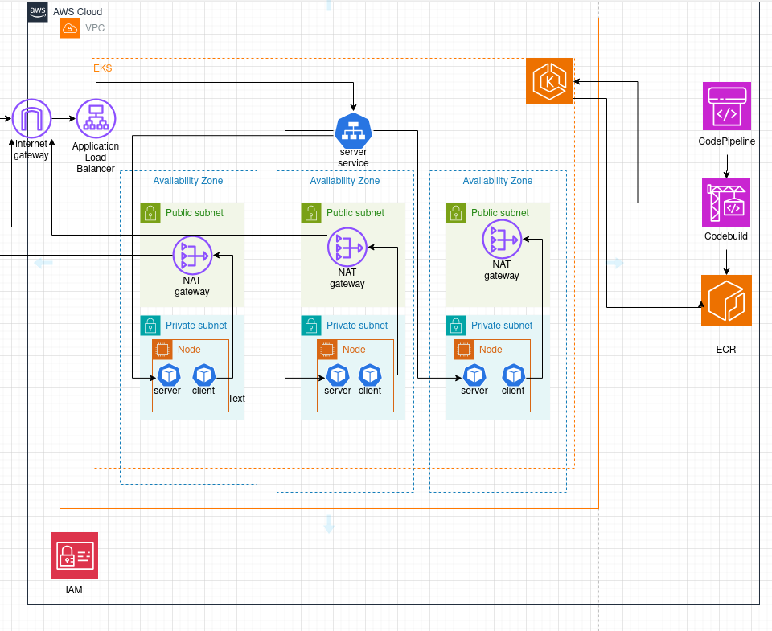

[Go To Repo](https://github.com/mozomiguel/prueba-simetrik-miguelmozo)
# Prueba simetrik

This repo is an example for deploying a gRPC service and client on Amazon EKS and exposing it via an Application Load Balancer (ALB).  


## Prerequisites

* aws cli installed and configured with a rol with the necesary permisions to deploy all the resources.
* Terraform installed
* An AWS codeconnection to the github repository that you'll use as a source for the cicd pipeline. you need to set up this before because you need to set some things in github and you can´t do this using terraform

## Architecture


In the architectural diagram, both the client and server applications are shown as Kubernetes pods deployed within an EKS cluster. The server pods are exposed internally as a service, which is then made publicly accessible through an Ingress that provisions an ALB. The client connects to the server application over the internet using NAT Gateways to gain access since the application resides within a private subnet. Although both the client and server are part of the same cluster, the connection is routed through the internet to simulate the scenario of an external client. 

The diagram also shows that the EKS cluster is deployed within a VPC spanning three availability zones (to ensure high availability). Each availability zone contains both a public and a private subnet. Additionally, an EKS node is deployed in each private subnet, while a NAT Gateway is deployed in each public subnet, this is to provide internet access to resources located within the private subnets.

## Deployment

The entire infrastructure will be deployed using Terraform. after cloning the repository, it is necessary to modify the `terraform/variables.tf` file, specifically the `connection_arn` variable, by replacing the default value with the ARN of the AWS CodeConnection that you intend to use for the CI/CD pipeline.
now it will be necessary to initialize the Terraform project.

```
cd terraform
terraform init
```
[Optional] We can then run a `terraform plan` to review the resources that will be deployed.

Finally, we proceed with the deployment.

```
terraform apply -auto-approve
```

[Go To Repo](https://docs.aws.amazon.com/eks/latest/userguide/aws-load-balancer-controller.html)